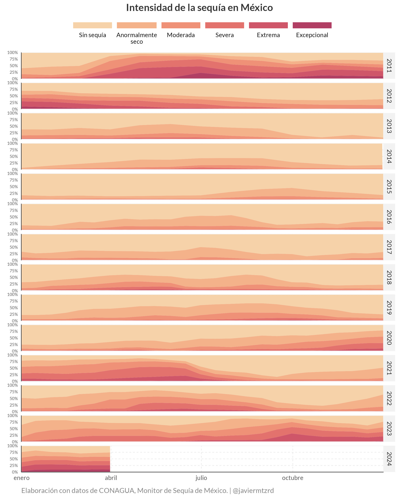
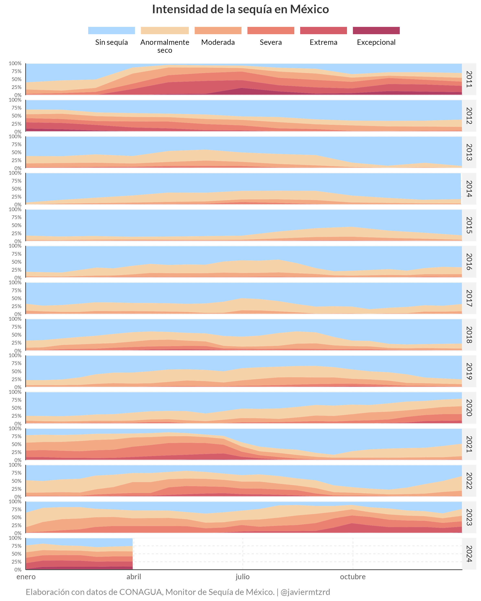
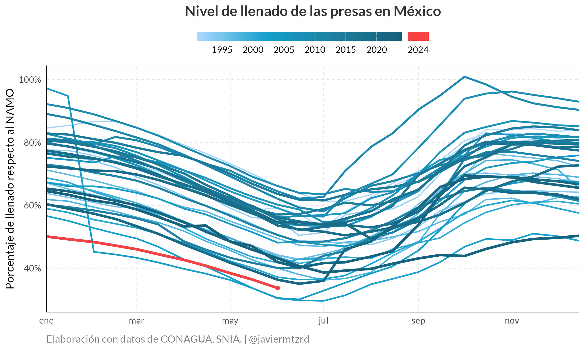
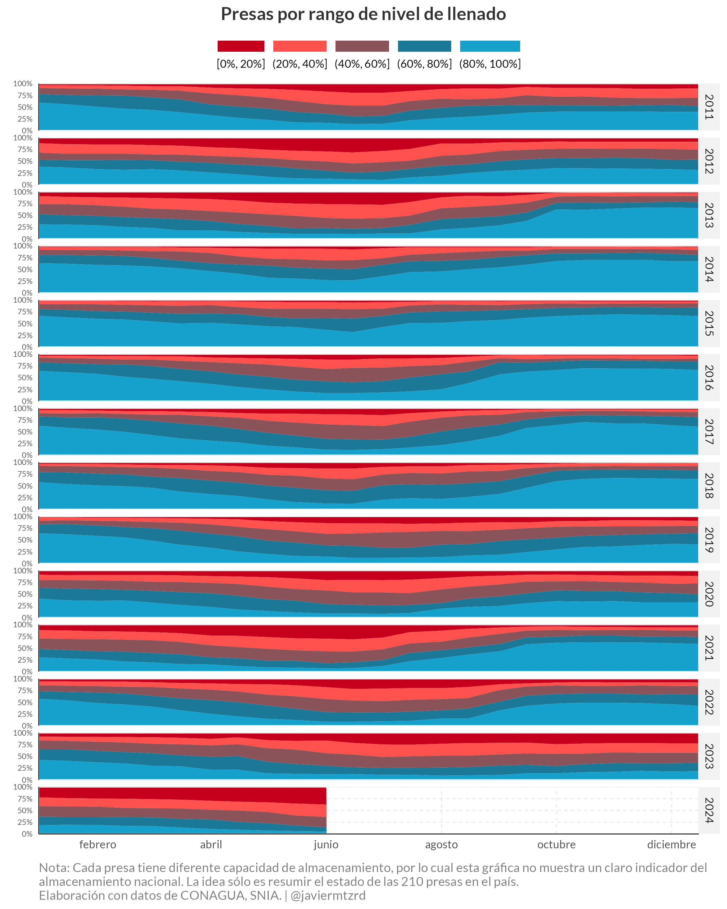

<!-- README.md is generated from README.Rmd. Please edit that file -->

```{r, include = FALSE}
knitr::opts_chunk$set(
  collapse = TRUE,
  comment = "#>"
)
```

# climate-mx

<!-- badges: start -->

<!-- badges: end -->

Este repositorio contiene los scripts para mostrar la evolución de la sequía y el almacenamiento de las presas en México.








