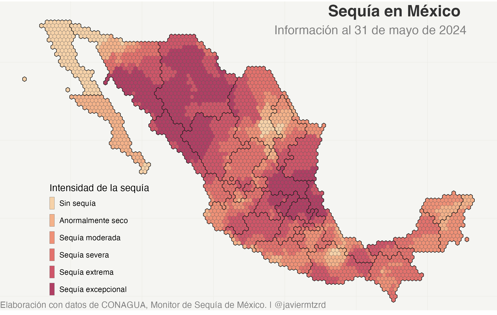
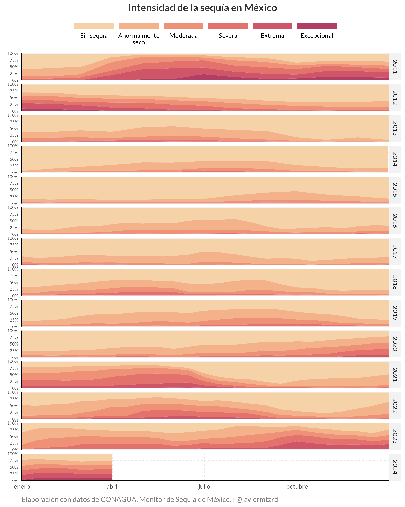
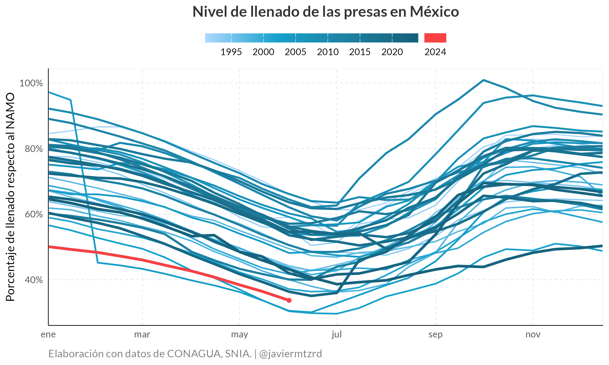
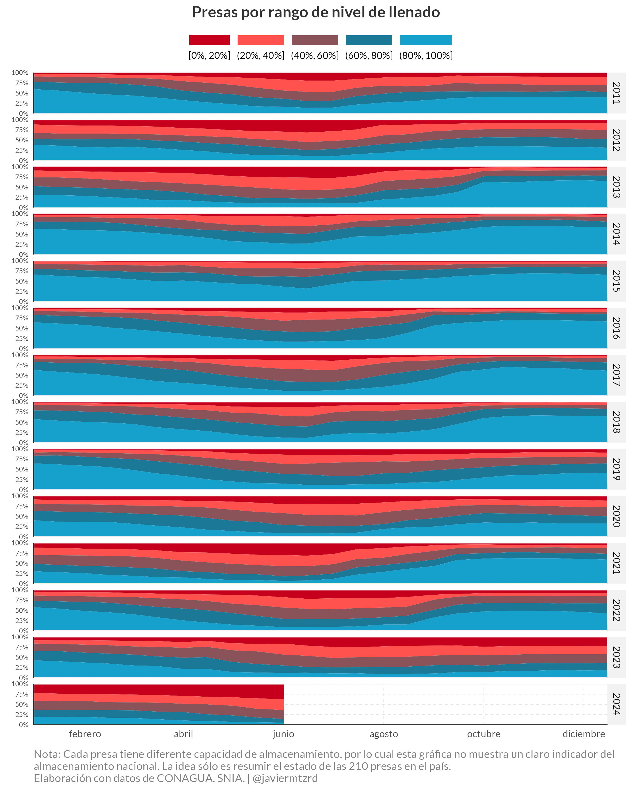

<!-- README.md is generated from README.Rmd. Please edit that file -->

# climate-mx

<!-- badges: start -->
<!-- badges: end -->

Este repositorio contiene los scripts para mostrar la evolución de la
sequía y el almacenamiento de las presas en México.

